

# 🚗 Vehicle Access Control System (VACS)
## سیستم کنترل ورود و خروج خودرو

---

## 👤 اطلاعات پروژه

| | |
|--|--|
| **نام دانشجو** | خدیجه رکنی |
| **شماره دانشجویی** | 40213343 |
| **استاد** | دکتر سید مهرداد اسلامی مهدی آبادی |
| **درس** | تحلیل و طراحی نرم‌افزار |
| **سال تحصیلی** | 1405-1404 ( ترم بهمن ) |

---

## 📋 شرح سیستم

سیستم کنترل ورود و خروج خودرو (VACS) یک نرم‌افزار مدیریتی است که به منظور کنترل و نظارت بر تردد خودروها در محیط سازمانی طراحی شده است. هدف اصلی این سیستم افزایش امنیت سازمان از طریق کنترل دقیق ورود و خروج خودروهای مجاز و جلوگیری از تردد خودروهای غیرمجاز می‌باشد.

در این سازمان تعدادی راهبند وجود دارد که هر راهبند به یک یا چند دوربین پلاک‌خوان مجهز است. هنگامی که خودرویی به راهبند نزدیک می‌شود، دوربین پلاک‌خوان به‌صورت خودکار شماره پلاک خودرو را تشخیص داده و به موتور کنترل دسترسی ارسال می‌کند. سیستم پلاک دریافتی را با پایگاه داده تطبیق می‌دهد. در صورت وجود مجوز معتبر راهبند باز شده و رویداد با وضعیت GRANTED ثبت می‌گردد. در غیر این صورت راهبند بسته می‌ماند و رویداد با وضعیت DENIED ثبت می‌شود.

  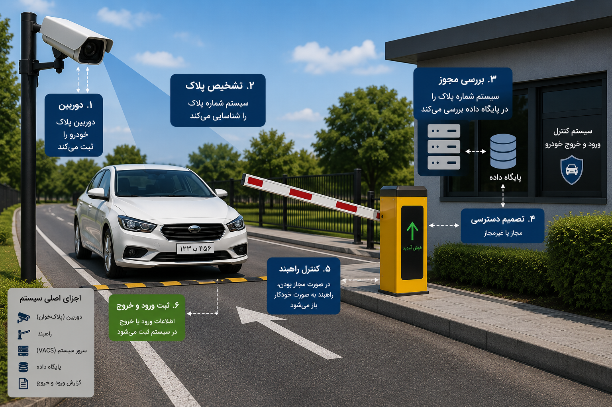

<b>Figure 1.</b> Overall Workflow of the Vehicle Access Control System

---
|## 💻 نمونه نرم‌افزار

🔗 **[اینجا کلیک کنید — نمونه نرم‌افزار آنلاین](https://khadijerokni.github.io/vehicle-access-control-system/software/VACS.html)**

فایل `software/VACS.html` را در مرورگر باز کنید.
هیچ نصبی لازم نیست.

| نقش | Username | Password |
|-----|----------|----------|
| Admin | admin | admin123 |
| Guard | guard1 | guard123 |

---

## 🎯 زیرسیستم‌ها

| زیرسیستم | توضیح |
|----------|-------|
| 🚗 تعریف خودرو | ثبت و مدیریت خودروها و مالکان |
| 🚧 تعریف راهبند | ثبت راهبندها و دوربین‌های پلاک‌خوان |
| 🔐 سطح دسترسی | تعریف مجوز دسترسی هر خودرو به راهبندها |
| 🚦 کنترل دسترسی | تشخیص پلاک و کنترل راهبند |
| 📋 لاگ تردد | ثبت رویدادهای ورود و خروج |
| 📈 گزارش‌دهی | مشاهده و خروجی CSV |

---

## 🏗️ معماری نرم‌افزار

**معماری: 3-Tier Architecture + MVC**

| لایه | مسئولیت |
|------|---------|
| Presentation Layer | رابط کاربری و Controllers |
| Business Logic Layer | Services و AccessControlEngine |
| Data Access Layer | Repositories |
| Database | SQLite |

---

## 📊 نمودارها

| نمودار | پوشه |
|--------|------|
| Use Case Diagram | diagrams/usecase/ |
| DFD Level 0 | diagrams/dfd/ |
| DFD Level 1 | diagrams/dfd/ |
| Class Diagram تحلیل | diagrams/class/ |
| Class Diagram طراحی | diagrams/class/ |
| Sequence Diagram 1 — ثبت خودرو | diagrams/sequence/ |
| Sequence Diagram 2 — اعطای مجوز | diagrams/sequence/ |
| Sequence Diagram 3 — ورود خودرو | diagrams/sequence/ |
| ERD — Chen Notation | diagrams/erd/ |
| Component Diagram | diagrams/component/ |
| Product Backlog | diagrams/backlog/ |

---

## ✅ چک‌لیست مستندات

- [x] شرح سیستم
- [x] نمودار Use Case

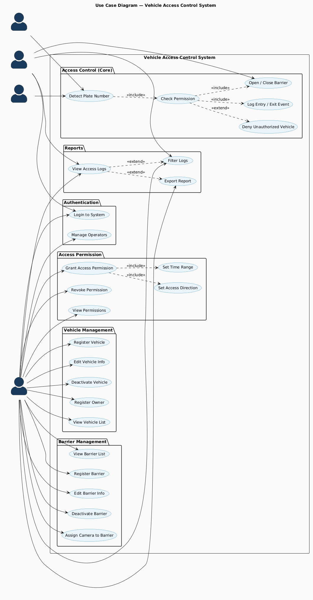

- [x] جدول Product Backlog — 24 User Story

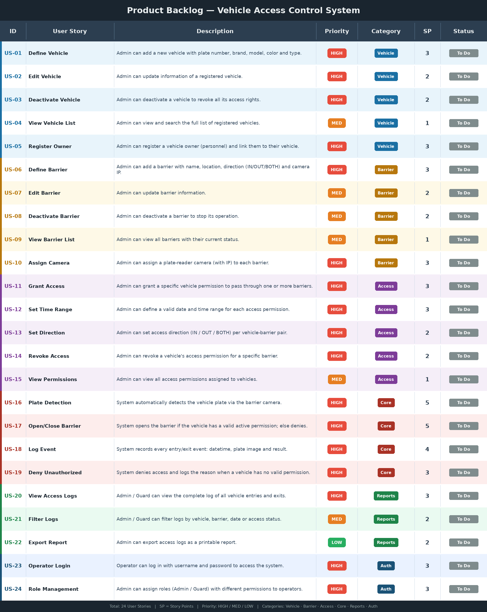

<b>Figure 1.</b> Product Backlog

- [x] نمودار کلاس تحلیل

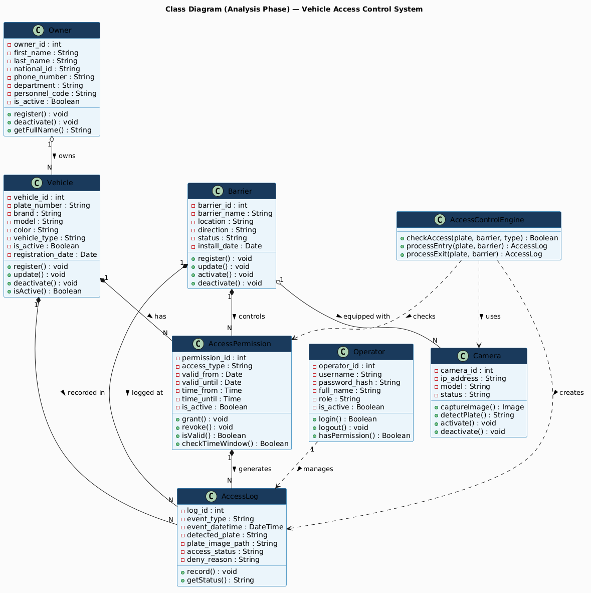

<b>Figure 5.</b> Class Analysis Diagram

- [x] DFD سطح ۰

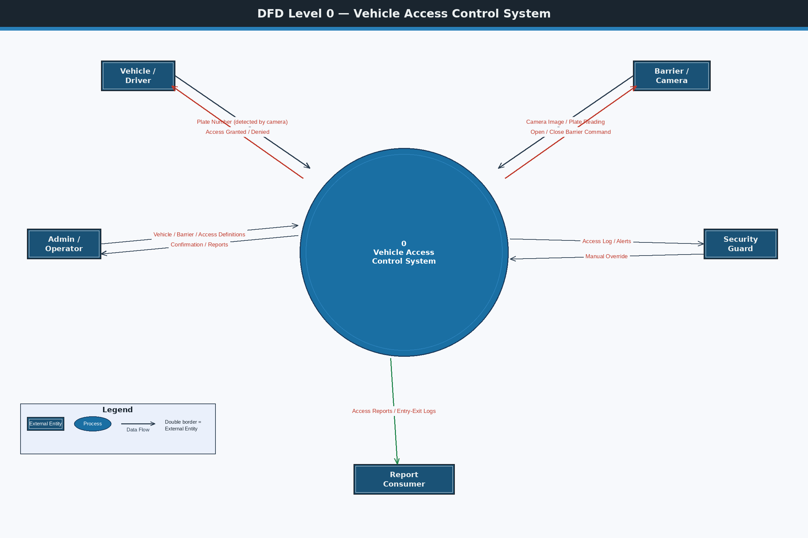

<b>Figure 2.</b> Data Flow Diagram (Level 0)

- [x] DFD سطح ۱

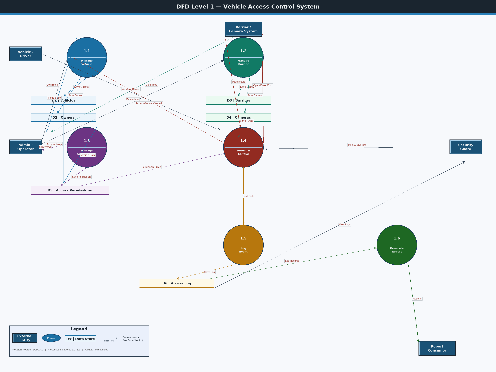

<b>Figure 3.</b> Data Flow Diagram (Level 1)

- [x] نمودار توالی ۱ — ثبت خودرو

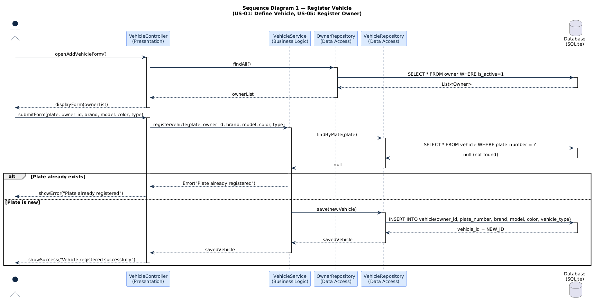

<b>Figure 8.</b> Sequence Diagram – Register Vehicle

- [x] نمودار توالی ۲ — اعطای مجوز

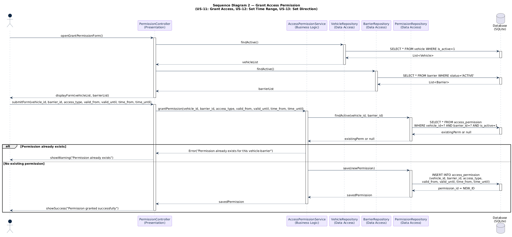

<b>Figure 9.</b> Sequence Diagram – Grant Permission

- [x] نمودار توالی ۳ — ورود خودرو

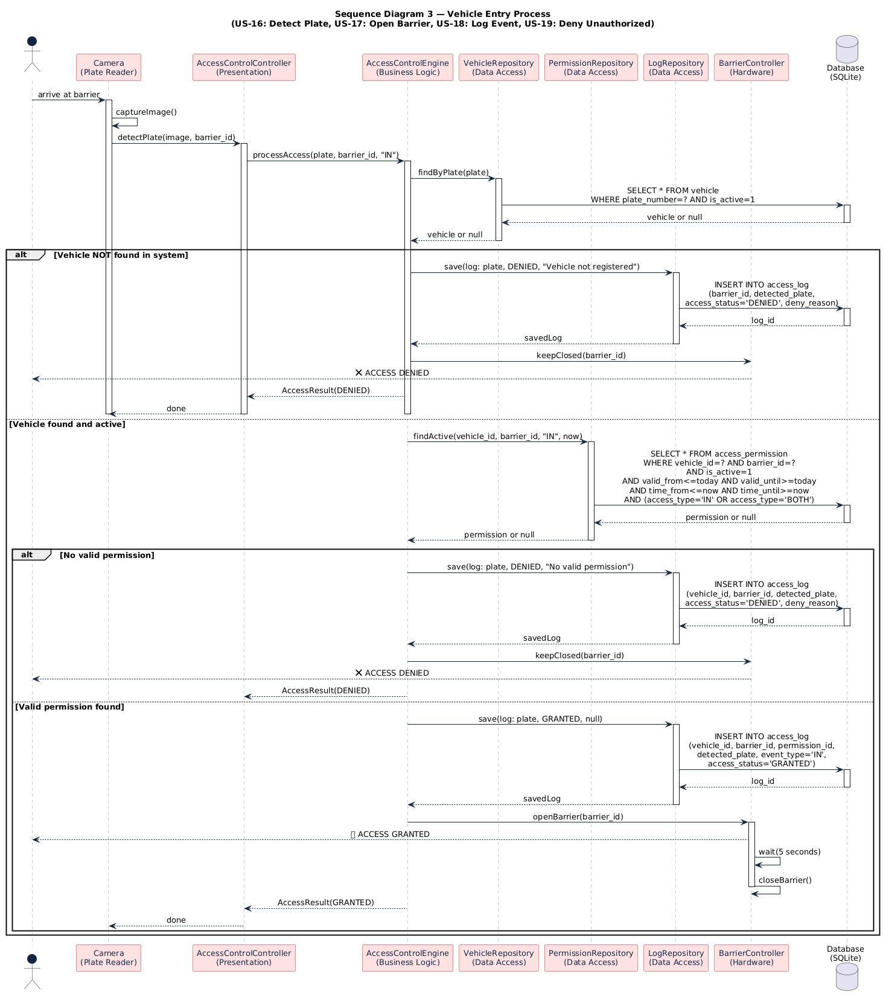

<b>Figure 10.</b> Sequence Diagram – Vehicle Entry

- [x] نمودار ERD

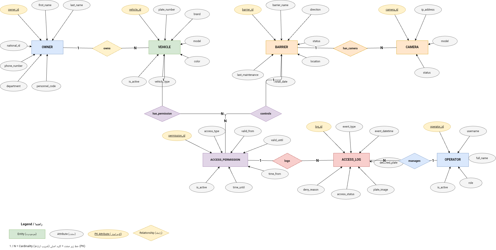

- [x] معماری نرم‌افزار
- [x] نمودار کلاس طراحی

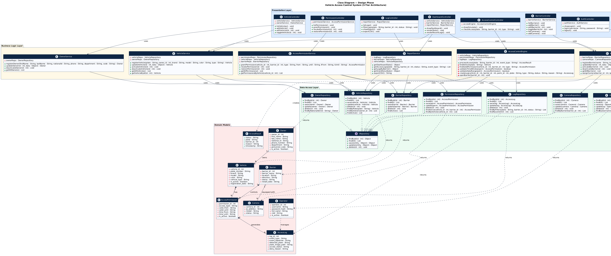

<b>Figure 6.</b> Class Design Diagram

- [x] نمودار کامپوننت

<b>Figure 7.</b> Component Diagram

- [x] نمونه نرم‌افزار
